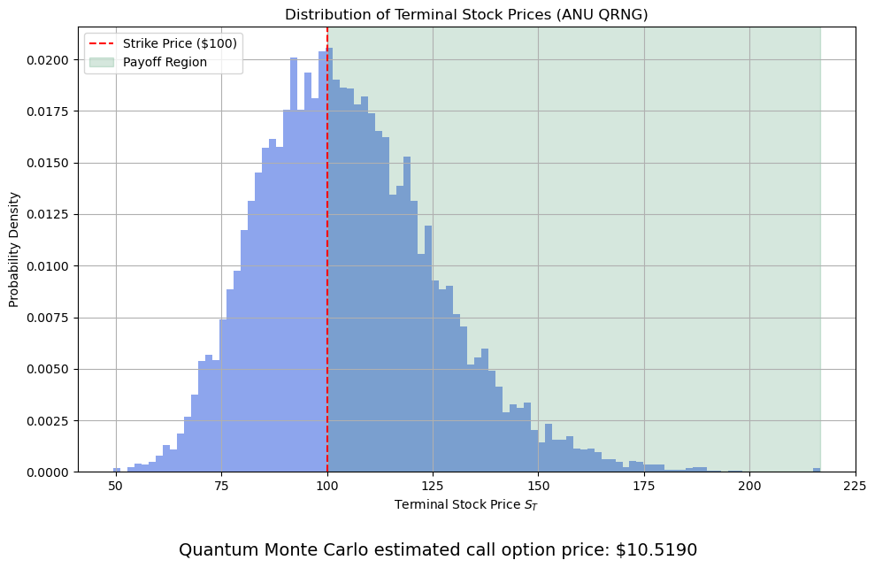

# Quantum Monte Carlo for Option Pricing

Hello! My name is Shreya. I built this project to explore the use of quantum computing techniques to simulate randomness in financial modeling, specifically for pricing call options. I will compare the classical Monte Carlo method to a quantum-enhanced approach that uses quantum-generated random numbers. 

By doing this, I hope to understand how quantum technology can be used in financial applications, especially in contexts where randomness and simulation are core components. 


## Project Goals
- demonstrate industry knowledge of terms and definitions
- build a classical Monte Carlo simulator to price options
- implement a Quantum Random Number Generator (QRNG)
- replace classical randomness with quantum randomness to simulate stock price paths
## 🛠 Skills
Python, Quantum Computing, Monte Carlo Simulation, Financial Modelling, API Integration, Data Visualization, Error Handling, Statistical Analysis, Jupyter Notebooks


## Lessons Learned

While building this project, I gained a deeper understanding of how randomness impacts financial simulations, especially in Monte Carlo option pricing. Integrating true quantum randomness through the ANU QRNG API was both fascinating and challenging, as it required managing API rate limits and implementing fallbacks to classical pseudorandom numbers to maintain smooth operation. I also improved my error handling skills to ensure the program could gracefully recover from network issues or API errors. Finally, visualizing the simulated stock price distributions helped me better interpret the results and communicate the impact of quantum-enhanced randomness in finance.

## Environment Variables

To run this project, you will need to add the following environment variables to your .env file

`secretKey`

Follow the instructions on the jupyter notebook. 

## Resources
| Resource                                                                 | Type       | Description                                 |
| :----------------------------------------------------------------------- | :--------- | :------------------------------------------ |
| https://www.ibm.com/quantum/blog/quantum-markov-chain-monte-carlo       | Article    | Quantum Markov Chain Monte Carlo blog post |
| "Quantum Computing for Everyone" by Chris Bernhardt (2019)               | Book       | Intro to quantum computing                  |
| "Six Ideas that Shaped Physics" by Thomas Moore, 4th Edition             | Book       | Foundational physics concepts               |
| https://quantumnumbers.anu.edu.au/faq                                   | Website    | FAQ for ANU Quantum Random Number Generator |

## Screenshots




## License

[MIT](https://choosealicense.com/licenses/mit/)


[](https://choosealicense.com/licenses/mit/)
## API Reference

#### Get quantum random numbers

```http
  GET https://api.quantumnumbers.anu.edu.au
